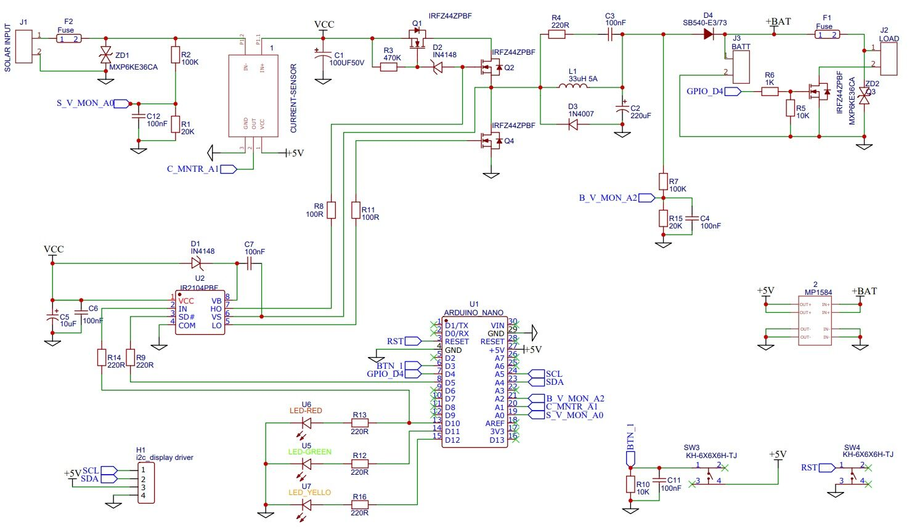

# MPPT Solar charge controller using Microcontroller - v4

MPPT (Maximum Power Point Tracking) Solar Charge Controller using Arduino to optimize solar charging efficiency. The controller converts excess solar panel voltage into current, maximizing energy use.

Designed the schematic and PCB, programmed an Arduino Nano, and displayed charging parameters on a 20x4 LCD screen. Key metrics include solar panel voltage, current, power, battery voltage, and charger state.

Tested with a 50W solar panel and a 12V lead-acid battery, ensuring optimal performance. This project showcases advanced solar charging technology and precise design methods.

## Schematic

## List of componnets

| S.N. | Components                | Quantity | 
|------|---------------------------|----------|
| 1    | Arduino Nano              | 1        | 
| 2    | 20x4 LCD Display          | 1        | 
| 3    | ACS712 Current Sensor     | 1        | 
| 4    | IR2104 IC                 | 1        | 
| 5    | MOSFET IRFZ44             | 4        | 
| 6    | Transistor 2N2222A        | 1        | 
| 7    | Diode P6KE36CA            | 1        | 
| 8    | Diode 1N4007              | 1        | 
| 9    | Diode 1N4148              | 2        | 
| 10   | Push Button Switch        | 2        | 
| 11   | Resistor 100K             | 1        | 
| 12   | Resistor 20K              | 2        | 
| 13   | Resistor 470K             | 1        | 
| 14   | Resistor 10K              | 3        | 
| 15   | Resistor 1K               | 1        | 
| 16   | Resistor 220Ω             | 6        | 
| 17   | Capacitor 220uF           | 1        | 
| 18   | Capacitor 10uF            | 2        | 
| 19   | Capacitor 0.1uF           | 6        | 
| 20   | Inductor 33uH             | 1        | 
| 21   | Red LED                   | 1        | 
| 22   | Green LED                 | 1        | 
| 23   | Blue LED                  | 1        | 
| 24   | Solar Panel (12/24/36V)   | 1        | 
| 25   | Lead Acid Battery 12V     | 1        | 
| 26   | Terminal Blocks           | 3        | 
| 27   | Female Headers            | 2 Sets   | 
| 28   | DC Jack                   | 1        | 
